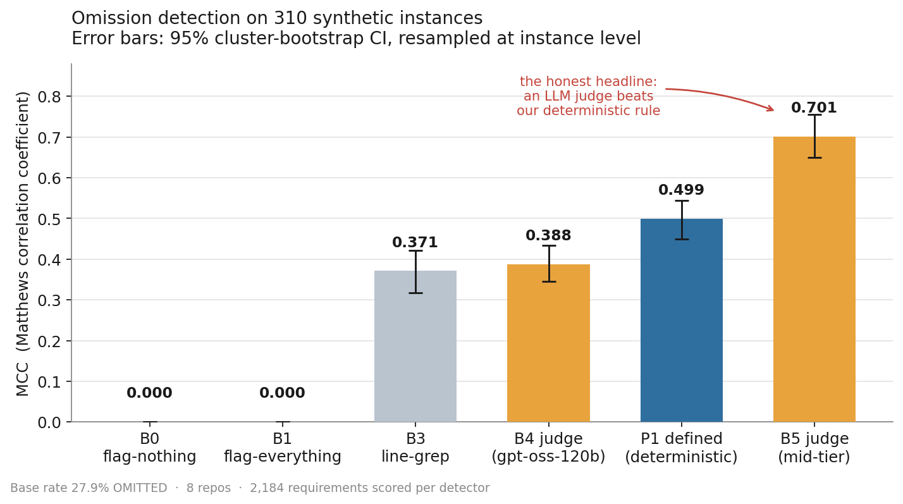
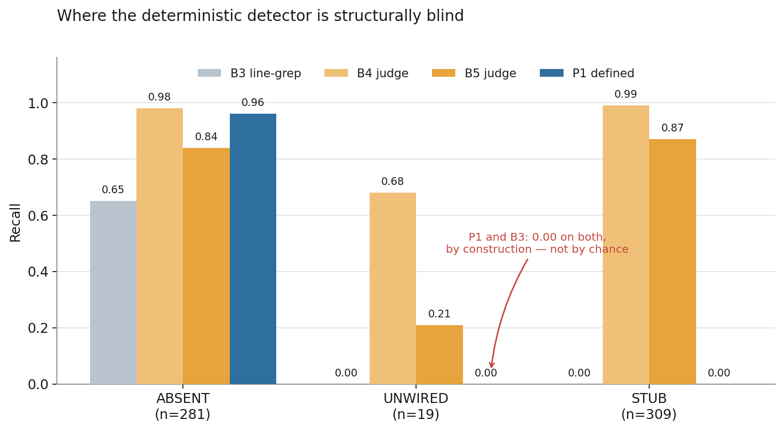
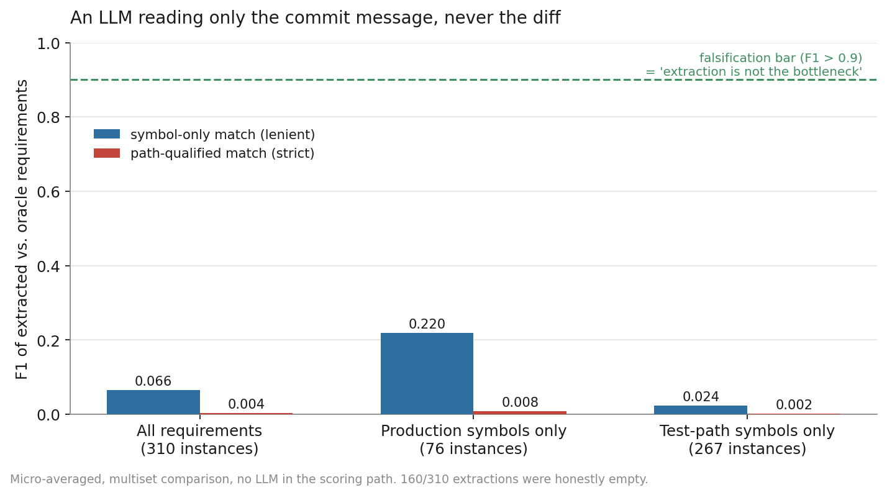
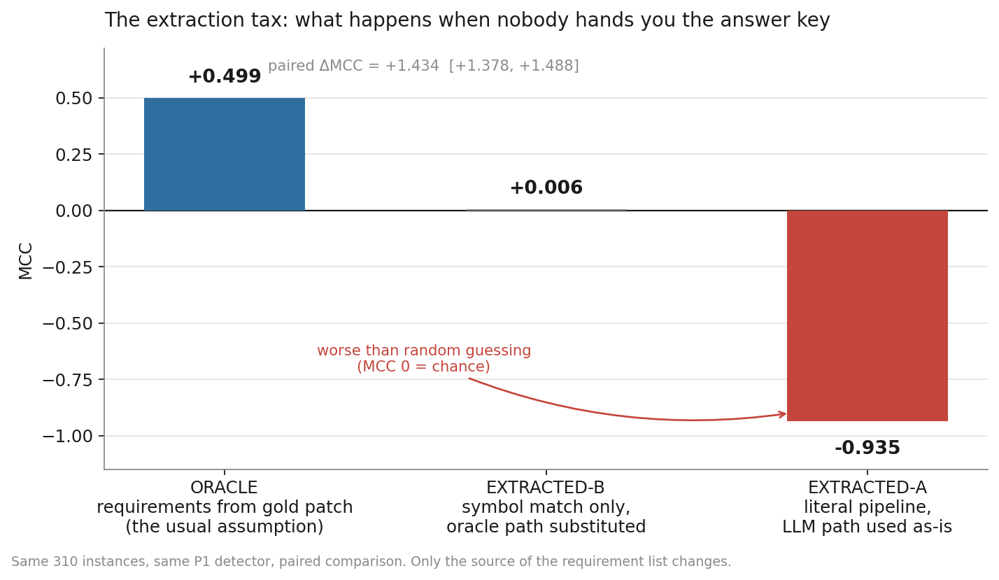

# omitbench-engineering-blog

# The Detector That Lost: Building OmitBench, and Publishing the Numbers That Didn't Flatter It

*How I built a benchmark for silent omissions in AI-agent code patches, watched my deterministic detector lose to an LLM judge, measured a −0.935 MCC collapse when I removed one convenient assumption, and shipped the whole thing as a CI gate anyway.*

---

## The failure mode nobody's CI catches

An AI coding agent opens a pull request. The description says it implemented three things. The diff implements two.

Nothing crashes. Tests pass — because the missing piece had no test. The reviewer skims a clean-looking diff, sees a confident summary, and merges. The omission surfaces three weeks later as a bug report nobody can trace back to that PR.

This is not a hypothetical. It is the dominant failure class in agentic coding, and the research has converged on it from several directions at once:

- SWE-Compass, analyzing 600 error traces per model, found that **Requirement Misinterpretation (30–34%)** and **Incomplete Solution & Side Effects (29–42%)** together account for more than 60% of agent failures — while Technical Knowledge Gap sits at only 5–8%. The bottleneck is not that models can't code. It's that they don't finish what was asked.
- A taxonomy of unimplemented requirements from end-to-end agent development benchmarks splits the problem cleanly: **Missing Component or Feature (32.4%)** and **Incomplete Implementation (18.1%)**.
- Most damning, the "false success" literature finds agents asserting completion when environment state says otherwise — in one study, **75.8% of self-assessing coding-agent trajectories** with explicit status claims were false successes. In the same work, **no LLM judge configuration exceeded AUROC 0.65** at detecting it.

That last number is the one that motivated this project. If agents fail silently, and the obvious fix — ask another LLM — is barely better than a coin flip weighted slightly in your favor, then the interesting question is: **can a boring, deterministic, AST-based rule do better?**

I built OmitBench to answer that. The answer turned out to be *no, not overall* — and that's the most useful thing I learned.

---

## What OmitBench actually is

A labelled benchmark plus a detector suite for **silent omissions**: requirements named in a task specification that never land in the resulting patch.

**Corpus.** 310 synthetic instances derived from 8 mature Python repositories — attrs, click, flask, httpx, itsdangerous, jinja, requests, werkzeug. 13,104 records, 2,184 requirements scored per detector, base rate **27.9% OMITTED**.

**The mutation pipeline.** Each instance starts from a real merged commit. Requirements are derived from the gold patch via AST diffing (`new_symbols(patch_before, patch_after)` → a flat list of `(path, symbol)` pairs). Then a mutation removes one requirement from the patch in one of three ways:

| Class | What the mutation does | n |
|---|---|---|
| **ABSENT** | The symbol is never defined at all | 281 |
| **UNWIRED** | The symbol is defined but never called from anywhere | 19 |
| **STUB** | The symbol is defined with an empty or trivial body | 309 |

That taxonomy is not arbitrary — it maps directly onto the empirical failure taxonomy above. ABSENT is "missing component." STUB is "incomplete implementation." UNWIRED is the sneakiest: the code exists, the symbol resolves, imports work, and nothing ever invokes it.

**Detectors evaluated:**

| ID | Detector | Type |
|---|---|---|
| B0 | flag-nothing | Degenerate baseline |
| B1 | flag-everything | Degenerate baseline |
| B3 | line-grep, no AST | Naive string match |
| B4 | LLM judge (gpt-oss-120b, reasoning) | Paid API |
| B5 | LLM judge (mistral-medium-3) | Paid API |
| **P1** | **`defined` — AST check** | **Deterministic, offline** |

---

## The protocol, which mattered more than the code

Before a single number was measured, I froze six rules in `CLAUDE.md`. In hindsight, these rules are the actual contribution of the project — the detector is 200 lines of AST walking; the protocol is what makes the numbers mean anything.

**1. The detector never sees the gold patch.**
SWE-bench's most-cited weakness is exactly this. Independent audits found that **32.67% of successful patches involved solution leakage** — the answer was sitting in the issue text — and a further **31.08% passed because of inadequate tests**. Roughly 94% of instances predate major model knowledge cutoffs, making memorization indistinguishable from reasoning.

I couldn't afford to hand-wave this. Leakage is enforced by runtime canary tests in `tests/test_leakage.py` that fail loudly if diff content ever reaches a detector's input. When T5 later introduced a second component that also had to stay blind (the requirement extractor), it got its own symmetric guard rather than an assumption.

**2. Measure once. Never tune after seeing the result.**
If the bar isn't cleared, write the null result. Do not adjust the corpus, the threshold, or the prompt to make the number better. This rule is easy to write and genuinely uncomfortable to follow — more on that below.

**3. MCC is the headline metric, not F1.**
With a 27.9% base rate, F1 flatters classifiers that spray positives. Chicco and Jurman's analysis is unambiguous: accuracy and F1 can produce inflated, misleading results on imbalanced data, while MCC only scores high when a classifier does well across **all four** confusion-matrix cells, proportionally to both class sizes. The recent LLM-judge meta-evaluation literature reaches the same conclusion from a different angle, arguing that a chance-corrected metric should be the headline reliability number rather than raw agreement.

Here's why that matters concretely — look at the B1 baseline in the results below. `flag-everything` achieves **F1 = 0.44**. That would look respectable in a table. Its MCC is **0.000**, which is the truth: it has zero discriminative power.

**4. Cluster bootstrap CIs, resampled at the instance level.**
Requirements within a single instance share a repo, a commit, and a specification. They are not independent draws. Naive row-level resampling would treat 2,184 correlated requirements as 2,184 independent observations and produce confidence intervals far tighter than the evidence supports — the cluster bootstrap exists precisely to preserve within-cluster dependence by resampling whole clusters.

**5. Paired comparisons where possible.**
Two independent CIs overlapping does not mean two detectors are statistically indistinguishable. Every head-to-head claim in this project is a paired ΔMCC computed on identical instances.

**6. `results/pilot.json` is frozen.**
A week-2 snapshot, never edited. Every later claim is a delta from it. At the end of the project I verified with `git log` that exactly one commit in the repository's entire history has ever touched that file, and it predates all the work being audited.

---

## Result 1: the headline that didn't flatter me

| Detector | P | R | F1 | MCC | MCC 95% CI | FPR |
|---|---|---|---|---|---|---|
| B0 flag-nothing | 0.00 | 0.00 | 0.00 | 0.000 | [0.000, 0.000] | 0.000 |
| B1 flag-everything | 0.28 | 1.00 | 0.44 | 0.000 | [0.000, 0.000] | 1.000 |
| B3 line-grep | 0.75 | 0.30 | 0.43 | 0.371 | [0.317, 0.421] | 0.039 |
| B4 LLM judge | 0.40 | 0.97 | 0.56 | 0.388 | [0.345, 0.434] | 0.569 |
| **P1 defined** | **0.80** | **0.44** | **0.57** | **0.499** | **[0.449, 0.545]** | **0.043** |
| **B5 LLM judge** | 0.74 | 0.84 | 0.79 | **0.701** | [0.650, 0.756] | 0.113 |

Paired cluster bootstrap of MCC differences:

- P1 vs B3 line-grep: **+0.128** [+0.103, +0.156] ✓
- P1 vs B4 judge: **+0.111** [+0.055, +0.164] ✓
- **P1 vs B5 judge: −0.202 [−0.252, −0.150]** ✗

**A mid-tier LLM judge beat my deterministic detector, and the paired interval excludes zero.** This is not noise. The deterministic wedge I set out to demonstrate does not exist at the overall level.

This result sits in the first screen of the README, not in a limitations appendix. It would have been trivially easy to bury: report F1 only (where P1's 0.57 vs B5's 0.79 is a smaller-looking gap), or report independent CIs and note they "overlap somewhat," or quietly drop B5 for being a paid dependency. I did none of those, because rule 2 exists specifically to stop me.

**What P1 *does* win on is false-positive rate: 0.043 vs B5's 0.113.** That turns out to matter enormously for deployment, and it becomes the entire basis for the shipping decision later. But it is a different claim from "the deterministic approach is better," and conflating the two would have been dishonest.

---

## Result 2: where the detector is blind by construction

| Detector | ABSENT (n=281) | UNWIRED (n=19) | STUB (n=309) |
|---|---|---|---|
| B3 line-grep | 0.65 | 0.00 | 0.00 |
| B4 judge | 0.98 | 0.68 | 0.99 |
| B5 judge | 0.84 | 0.21 | 0.87 |
| **P1 defined** | **0.96** | **0.00** | **0.00** |

P1 scores **0.96 recall on ABSENT** and **exactly 0.00 on both UNWIRED and STUB**.

This is not a tuning failure. It's structural. P1 asks one question — *is this symbol defined in this file?* — and a stubbed function is still defined. An unwired function is still defined. The detector is answering its question correctly and the question is insufficient for two of the three classes.

Publishing the per-class breakdown rather than the aggregate is the difference between a benchmark and a marketing number. The aggregate MCC of 0.499 conceals the fact that the detector is a specialist, not a generalist. Anyone deploying it needs to know that a clean report means "no symbols are entirely missing," not "nothing was omitted."

This later became a required disclaimer in the CI gate's PR comment — the tool states its own blindness in the output a developer reads, not in documentation they won't.

---

## Result 3: two detectors I built, measured, and deleted

I also built P2 (`defined + reachable`) and P3 (`defined + reachable + body`), expecting them to fix the UNWIRED and STUB blind spots. They did fix recall — P3 reached 0.9868 recall.

They also had FPR of **0.83 and 0.84** respectively. MCC: P2 = 0.0868, P3 = 0.2013. Neither beat B3 line-grep — the naive string-matching baseline.

The pre-agreed criterion was: beat grep, or be deleted with a written reason. I tried the fix first (a public-API exemption to reduce false positives), measured it, and it narrowed the gap without closing it. So both detectors were removed from the detector registry, with before/after numbers and reasoning written into `ASSUMPTIONS.md §9`.

Deleting two-thirds of your novel contributions because they lost to `grep` is not fun. It is, however, what the protocol required, and it makes every surviving claim more credible.

---

## Result 4: the real-world corpus that couldn't answer the question

Synthetic mutations are a controlled instrument, not the real world. So I collected 8 real agent trajectories from live repositories — tqdm (×5), bandit, marshmallow, mkdocs — with hand-labelled requirements.

**Every single one was a clean success. 0 out of 16 requirements were OMITTED.**

A degenerate positive class. Recall is undefined; you cannot measure detection of a thing that never occurs in your sample.

What I *could* measure was false-positive behavior on real code, and that transferred well: P1's real-corpus **FPR was 0.062**, close to the synthetic **0.043**. That's a genuine external-validity signal — the detector doesn't start hallucinating omissions when it leaves the synthetic distribution.

But the honest framing is that this arm of the study failed to answer its primary question, and `ASSUMPTIONS.md §10` says so explicitly. n=8 with zero positives is not a validation; it is a pilot that tells you what to collect more of.

---

## Result 5: the extraction tax — removing the assumption everyone makes

Here is the finding I think actually matters, and it came from asking an uncomfortable question about my own benchmark.

Every number above depends on a hidden assumption: **the requirement list is derived from the gold patch.** The detector never sees the patch — the leakage guards enforce that — but the *requirements it checks against* were computed from it. That is a perfect-extraction oracle. Every result is therefore an upper bound.

In real deployment, nobody hands you the gold patch. You get an issue and a commit message, and you have to work out what was supposed to be built from text alone.

So I built an LLM extractor that reads **only** the issue/commit text — never the diff, enforced by its own leakage guard — and emits a JSON list of `{"symbol", "path"}`. Then I scored it against the oracle requirements, and re-ran detection using its output.

Two decisions locked before any measurement:

- **Matching is purely structural.** Symbol strings compared with exact, case-sensitive multiset (`Counter`) comparison, capping credit at `min(count_oracle, count_extracted)`. **No LLM anywhere in the scoring path** — using an LLM to judge LLM-extracted text would reintroduce exactly the noise source this experiment exists to isolate.
- **Two match strictnesses, both always reported.** Symbol-only (lenient — did it name the right function?) and path-qualified (strict — did it also know which file?). Reporting only the flattering one would be a choice, and choices made after seeing results are p-hacking.

I also added a falsification condition that was missing from the original task spec: **if extraction F1 came out above 0.9, the finding is "extraction is not the bottleneck, the tax is small."** That's a valid result. It was written down before the run so I couldn't retroactively decide what counted as interesting.

### Extraction quality

| Subset | Symbol-only F1 | Path-qualified F1 |
|---|---|---|
| All requirements (310) | **0.066** | 0.004 |
| Production symbols only (76) | **0.220** | 0.008 |
| Test-path symbols only (267) | 0.024 | 0.002 |

Nowhere near the 0.9 bar. Even on the fairest subset — production code only, the case the model has the best shot at — F1 is 0.220.

The output was **not** degenerate: 150 of 310 extractions were non-empty, no parse failures, and spot checks showed real inference rather than word-copying. On a vague commit message the model correctly returned an empty list. On a message that explicitly named a symbol, it got the name right and the file wrong. Only 2 path-qualified hits occurred in the entire corpus, both on commit messages that literally spelled out a file path.

This aligns with two decades of requirements-traceability research, which consistently reports that fully automated trace recovery falls short of the accuracy needed for unsupervised use. Even recent LLM-based traceability work reports recall in the 60–70% range and positions itself explicitly as *decision support with human oversight*, not automation.

### Detection under extracted requirements

| Condition | P | R | F1 | MCC |
|---|---|---|---|---|
| **ORACLE** (requirements from gold patch) | 0.802 | 0.445 | 0.572 | **+0.499** |
| **EXTRACTED-B** (symbol match, oracle path substituted) | 0.923 | 0.020 | 0.039 | **+0.006** |
| **EXTRACTED-A** (literal pipeline, LLM path used as-is) | 0.046 | 0.062 | 0.053 | **−0.935** |

Paired ΔMCC: ORACLE − A = **+1.434** [+1.378, +1.488]. ORACLE − B = **+0.493** [+0.424, +0.592].

**Under the literal pipeline, MCC goes negative — worse than flagging at random.** P1 is path-qualified by design; a wrong or null path forces near-universal false OMITTED verdicts (fp=791 against tp=38).

Condition B decomposes the failure. Once the path is corrected for symbol-matched items, **precision recovers fully to 0.923** — when the model names the right symbol, the detector's verdict is trustworthy. But **recall collapses to 0.020**. The tax is dominated by the extractor rarely naming the right symbol at all, then catastrophically compounded by path errors under literal deployment.

**The engineering conclusion:** requirement *extraction*, not omission *detection*, is the hard problem. A detector operating on free-text-derived requirements is not merely degraded — it is actively harmful. This reframed the entire product decision downstream.

Total cost of this experiment: **$0.0567.**

---

## The bug that would have been p-hacking if I'd stayed quiet

Condition B's first implementation produced **MCC −0.898**. I inspected it and found the bug: non-matching items were still being scored with their broken paths, meaning B was dominated by the same path noise as A — defeating its entire purpose of isolating path attribution from requirement understanding. Fixed to include only items naming a real oracle symbol, B became **+0.006**.

A bug fix that moves your number from −0.898 to +0.006 is exactly the shape of a p-hack. So the honest question is: *was the fix justified independently of the result?*

Two things make me confident it was, and one thing makes me uncomfortable:

1. **The fix restores the spec, it doesn't invent one.** Condition B was *defined* before any code ran as "symbol-identification only, oracle path substituted for symbol-matched items." Scoring non-matching items under B was always outside that definition. The bug was a deviation from a pre-registered design, not a post-hoc reinterpretation.
2. **Condition A — the headline number — is byte-identical across the buggy run, the fixed run, and an independent verification run** (P 0.046 / R 0.062 / F1 0.053 / MCC −0.935, tp=38 fp=791 fn=571 tn=7). The fix touched only the diagnostic, never the primary result.
3. **But the trigger for finding the bug was the bad number, not a pre-registered check.** I did not catch it by review; I caught it because −0.898 looked wrong. That ordering is worth stating plainly rather than dressing up.

All three points, including the uncomfortable one, are recorded permanently in `ASSUMPTIONS.md §11` with both numbers, the full diff, and the honest order of operations. Anyone auditing this can see the −0.898 and judge for themselves.

I'd argue this is the single most transferable practice in the project: **when a fix moves a number in the direction you wanted, write down the sequence, not just the justification.**

---

## Shipping it: a CI gate that discloses its own uncertainty

The final phase packaged the detector as a GitHub Action that comments on pull requests.

### Which detector ships?

B5 has the higher MCC (0.701 vs 0.499). It doesn't ship. Two reasons:

**It fails the acceptance bar it would be held to.** The gate's criterion was precision ≥ 0.80. B5's precision is 0.74. Shipping it would mean overriding my own threshold because I liked a different metric better.

**A paid API call per PR is an operational liability.** This is not theoretical. The AI code review market has converged on false-positive control as the make-or-break variable, and the reason is stated bluntly across the practitioner literature: the cost of one false positive is seconds of attention; the cost of a thousand is a team that has learned to scroll past every comment your tool ever posts. Independent head-to-head comparisons of commercial reviewers show the spread — roughly 2 false positives per run for the lowest-noise tool versus ~11 for the highest-recall one, with the high-recall tool catching nearly double the bugs. That trade is real and it has a wrong side for a merge-blocking gate.

P1's **FPR of 0.043** — the one axis where it decisively beat the judge — is precisely the property a CI gate needs. Plus: deterministic, no network, no per-PR cost, and reproducible offline.

### Requirements come from a structured checklist, never free-text

This is T5's finding applied directly. The gate parses requirements from a **structured markdown checklist** in the PR or issue body (`- [ ] symbol in path.py`). It does **not** attempt free-text extraction, because I measured that pipeline at MCC −0.935 and it would ship a tool that is worse than useless.

That's a product decision made from a negative result. The measurement didn't just document a limitation; it eliminated a design I would otherwise have built.

### The gate publishes its own confidence interval

Offline precision is **0.8018** against a 0.80 bar — clearing it by 0.0018, with a 95% CI of **[0.723, 0.885]** that straddles the threshold on both sides.

That's a thin margin, and hiding it would be indefensible. So the posted PR comment includes:

1. The finding: which checklist symbol is missing from the diff.
2. **The structural blindness disclaimer** — the gate only catches entirely-missing symbols; it is blind to unwired and stubbed code by design (0.00 recall on both), so a clean report must not be read as "nothing is unwired or stubbed."
3. **The precision caveat** — offline precision 0.80 against a 0.80 bar, with the CI straddling it.

A test asserts that the caveat is live-computed from the frozen baseline rather than hardcoded, by swapping the baseline fixture and checking the rendered numbers change.

There's also a falsification condition for the gate itself: if a future re-run drops precision below threshold, the gate suspends and flags in the README rather than silently continuing to post.

### Verified live, not just in pytest

A throwaway PR with a deliberately missing symbol. The workflow fired in **8 seconds** and posted a comment byte-identical to the renderer's expected output, with a precision value computed live from the frozen baseline.

**Measured:** p50 latency **12.0ms**, p95 **26.5ms** per instance — against a 10-second acceptance bar. 132/132 tests passing.

---

## What's still open, stated plainly

- **UNWIRED remains underpowered.** n=19 against a target of n≥100. The README calls it directional, not conclusive. It does not block the gate — whose acceptance criterion is overall precision — but it is not resolved.
- **The extraction tax is measured only on synthetic data.** With n=8 and zero positives, the real corpus could not support the same analysis. Whether the tax is larger or smaller on real issue text is genuinely unknown.
- **The 0.80 precision margin is thin and the CI straddles it.** A modest corpus change could flip it. The gate is designed to suspend itself if that happens, but a bar you clear by 0.0018 is a bar you should expect to renegotiate.
- **The gate has been verified, not adopted.** One live demo PR on my own repository is proof the mechanism works. It is not evidence of value in a real team's workflow, and I'm not going to claim otherwise.

---

## What I'd tell someone starting a similar project

**Write the falsification condition before you write the code.** Every task in this project had one except T6, and T6 was the only task where I found myself uncertain what would count as failure. That correlation is not a coincidence.

**Pick your headline metric before you see any numbers.** MCC over F1 wasn't a clever choice; it was a *pre-committed* one. Had I chosen after seeing results, B1's 0.44 F1 and P1's 0.57 F1 would have made a much more comfortable table than a 0.000 and a 0.499.

**Match your CI structure to your data's dependence structure.** Requirements inside one instance are not independent observations. Getting this wrong doesn't produce a wrong point estimate — it produces confidence intervals that lie, which is worse, because it's invisible.

**Build the ablation that could destroy your result.** T5 exists because I asked what my benchmark assumed. It returned the most negative number in the project and the most useful one. If you can't think of an assumption whose removal would hurt, you haven't looked hard enough.

**When you fix a bug that helps your numbers, publish the sequence.** Not just the justification — the order of operations. Reviewers can evaluate a justification. Only you know the sequence, so only you can disclose it.

**A tool that hides its own error bars will be trusted exactly once.** For anything that posts into a developer's workflow, uncertainty belongs in the output, not the appendix.

---

## Summary of results

| Question | Answer | Evidence |
|---|---|---|
| Does a deterministic detector beat LLM judges? | **No, not overall** | Paired ΔMCC vs B5: −0.202 [−0.252, −0.150] |
| Does it beat naive grep and a reasoning judge? | **Yes** | +0.128 [+0.103, +0.156]; +0.111 [+0.055, +0.164] |
| Does it generalize past ABSENT omissions? | **No** | 0.00 recall on UNWIRED and STUB, by construction |
| Do FP rates transfer to real repos? | **Yes, roughly** | Real 0.062 vs synthetic 0.043 |
| Can requirements be extracted from issue text alone? | **No** | F1 0.066 overall, 0.220 on production symbols |
| What does that cost detection? | **Everything** | MCC +0.499 → −0.935, paired Δ +1.434 |
| Is it deployable? | **Yes, narrowly scoped** | FPR 0.043, p95 26.5ms, verified live on GitHub |

---

## References

1. Chicco, D. & Jurman, G. (2020). *The advantages of the Matthews correlation coefficient (MCC) over F1 score and accuracy in binary classification evaluation.* BMC Genomics 21:6. https://doi.org/10.1186/s12864-019-6413-7
2. Aleithan, R. et al. (2024). *SWE-Bench+: Enhanced Coding Benchmark for LLMs.* — solution leakage and weak-test analysis of SWE-bench. arXiv:2410.06992
3. *SWE-Compass: Towards Unified Evaluation of Agentic Coding Abilities for Large Language Models.* arXiv:2511.05459 — trajectory failure-mode distribution.
4. *Benchmarking and Studying the LLM-based Agent System in End-to-End Software Development.* arXiv:2511.04064 — taxonomy of unimplemented requirements.
5. *From Confident Closing to Silent Failure: Characterizing False Success in LLM Agents.* arXiv:2606.09863 — false-success rates and LLM-judge AUROC ceilings.
6. *Bias in the Loop: Auditing LLM-as-a-Judge for Software Engineering.* arXiv:2604.16790 — prompt-perturbation sensitivity of code judges.
7. *Reliability without Validity: A Systematic, Large-Scale Evaluation of LLM-as-a-Judge Models.* arXiv:2606.19544 — the case for chance-corrected headline metrics.
8. *TraceLLM: Leveraging Large Language Models with Prompt Engineering for Enhanced Requirements Traceability.* arXiv:2602.01253 — traceability recall ceilings and the semi-automation framing.
9. Sourcegraph (2026). *AI Code Review in 2026: How It Works and How to Adopt It.* — false-positive economics in PR-facing tooling.
10. Field, A. & Welsh, A. (2007); Harden, J. (2011) — cluster bootstrap for clustered/hierarchical data.

---

**Repository:** `github.com/Avnish1505/Omitbench`
Corpus, detectors, extraction pipeline, CI gate, frozen baselines, and the full `ASSUMPTIONS.md` audit trail — including the numbers that didn't work out.
